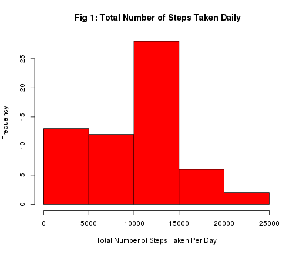
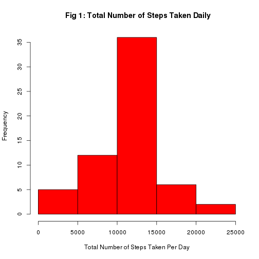

PA1 Assignment.
========================================================

1. INTRODUCTION
 
 This assignment looks at data derived from an activity monitoring devices. These devices monitor the health via activity of the wearer and are becoming quite common. The data consists of data from such a devices of an anonymous individual collected during the months of October and November. It records the number of steps taken in 5 minute intervals each day.
 
 The variables in this dataset are:

steps: Number of steps taking in a 5-minute interval with missing values are recorded as NA.

date: The date on which the measurement was recorded.

interval: An identifier for each 5-minute interval in which data was collected.

2. DATA PROCESSING STEPS
===============================================
The raw data is loaded and stored in variable "data_main" into R via the code below


```r
data_main <- read.csv("/home/ben/Coursera/RRH/activity.csv")
```


Columns name and summary of the data is looked at via the following code:


```r
names(data_main)
```

```
## [1] "steps"    "date"     "interval"
```

```r

summary(data_main)
```

```
##      steps               date          interval   
##  Min.   :  0.0   2012-10-01:  288   Min.   :   0  
##  1st Qu.:  0.0   2012-10-02:  288   1st Qu.: 589  
##  Median :  0.0   2012-10-03:  288   Median :1178  
##  Mean   : 37.4   2012-10-04:  288   Mean   :1178  
##  3rd Qu.: 12.0   2012-10-05:  288   3rd Qu.:1766  
##  Max.   :806.0   2012-10-06:  288   Max.   :2355  
##  NA's   :2304    (Other)   :15840
```


we plot a histogram to show the number of steps taken each day. we remove NA's shown below 


```r
data_hist <- na.omit(data_main)
```


To find the total number of steps per day, a script(PA1-totalsteps.R) is written. This scripts provides a function to output a vector of the total number of steps per day. The script is loaded into R as follows:


```r
source("/home/ben/Coursera/RRH/pa-ass1/scripts/PA1-totalSteps.R")
```


The histogram of total number of steps per day is created as follows


```r
z <- totalSteps(data_hist)
hist(z, xlab = "Total Number of Steps Taken Per Day", col = "red", main = paste(" Fig 1: Total Number of Steps Taken Daily"))
```

 


The mean and median are calculated as detailed below


```r
mean_steps <- mean(z)
mean_steps
```

```
## [1] 9354
```

```r
median_steps <- median(z)
median_steps
```

```
## [1] 10395
```

```r
rm(z)
```


we then plot a time series graph of the average number of steps taken, averaged across all days vs the 5-minute interval. To do this, we require a script(PA1-intervalMean.R) to calculate the mean/average of  number of steps per interval across all days. The script is loaded in R as outlined below

```r
source("/home/ben/Coursera/RRH/pa-ass1/scripts/PA1-intervalmean.R")
```


the interval means across all days is calculated thus:


```r
z <- intervalMean(data_hist)
```


The time series plot is created thus


```r
plot(z$interval, z$intervalMean, type = "l", pch = 49, ylab = "Average Number of Steps per interval,across All Days", 
    xlab = "Interval", main = paste("Fig2: Times series of average number of steps per day"))
```

 


The interval with the maximum average of steps(across all days) is found as follows


```r
z$interval[(z$intervalMean == max(z$intervalMean))]
```

```
## [1] 835
```

```r
rm(z)
```


The number of missing values(NA's) is reported as follows:


```r
z <- as.data.frame(is.na(data_main))
dim(z[which(z$date == TRUE | z$steps == TRUE | z$interval == TRUE), ])[1]
```

```
## [1] 2304
```


To see which columns have NA values, we do as follows:


```r
dim(z[which(z$date == TRUE), ])[1]
```

```
## [1] 0
```

```r
dim(z[which(z$interval == TRUE), ])[1]
```

```
## [1] 0
```

```r
dim(z[which(z$steps == TRUE), ])[1]
```

```
## [1] 2304
```

 it clearly shows that the variable "steps" contributes all the NA values.
 
 we fix the NA values by replacing them with the mean of that interval. we use a script(PA1-imputNa.R) to do this.
 

```r
source("/home//ben/Coursera/RRH//pa-ass1/scripts/PA1-imputNa.R")
```


we create a new data set with the same number of rows and columns by


```r
data_new <- imputNA(data_main)
```


A new histogram is drawn below


```r
z <- totalSteps(data_new)
hist(z, xlab = "Total Number of Steps Taken Per Day", col = "red", main = paste(" Fig 1: Total Number of Steps Taken Daily"))
```

 


also new mean and median are calculated


```r
mean_steps <- mean(z)
mean_steps
```

```
## [1] 10766
```

```r
median_steps <- median(z)
median_steps
```

```
## [1] 10766
```

```r
rm(z)
```


